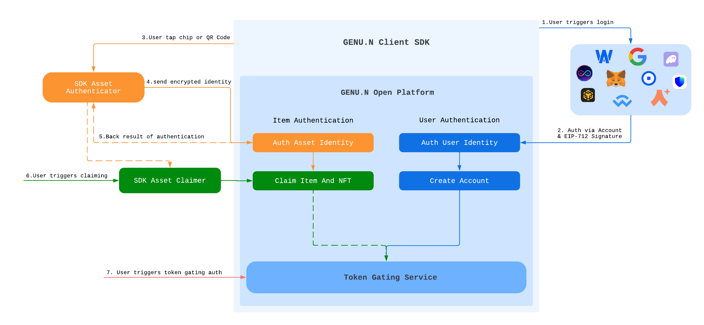

# GENU.N Open Platform
We are thrilled to introduce the GENU.N Open Platform, an extension of our commitment to innovation and seamless integration. This platform is designed to empower developers and businesses by providing access to our sophisticated APIs and SDKs, allowing for the integration of GENU.N's groundbreaking technology directly into your own products and services. Our Open Platform facilitates the connection of physical items to their digital counterparts, enabling a host of applications from enhancing product authenticity to creating immersive digital experiences and beyond.

With the GENU.N Open Platform, your venture into the interconnected world of digital and physical realms is supported by robust security, transparency, and the endless possibilities afforded by blockchain technology. Explore our documentation to start integrating GENU.N capabilities into your applications today, and join us in shaping the future of digital-physical interactions.

## High Level Architecture

GENU.N Client SDK Repo: [https://github.com/GENU-N/genun-api-sdk-js.git](https://github.com/GENU-N/genun-api-sdk-js.git)
GENU.N Client SDK Sample: [View Sample](https://open.genun.tech/sdk/sample.html){target="_blank"}